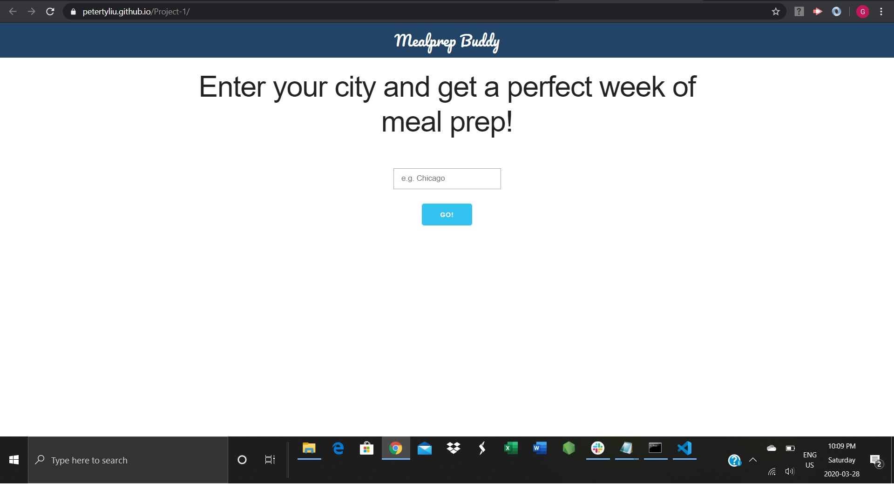
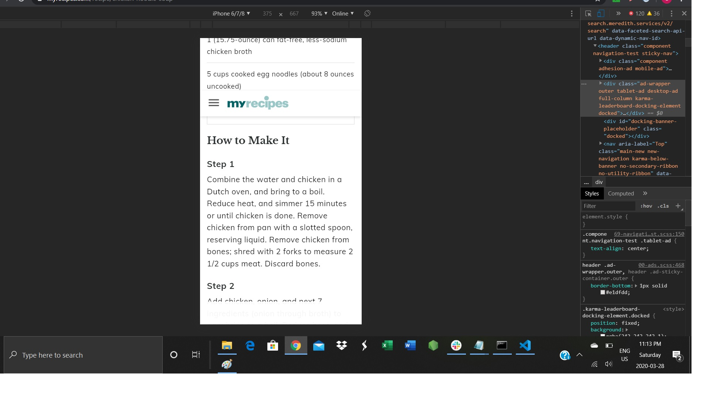

# Project-1

First group project

## Team Members
* Peter
* Solomon
* Gayathiri

# MealPrep is a responsive app that suggest meal plans to users for a  selected location based on a five-day weather forecast. 

# Just type in your city and Mealprep Buddy will plan out your week of meals, recipes and shopping list included. 

# You’ll get to cook exciting meals that match your day

# This app use external API  to get the live weather data from OpenWeatherMap, also it uses another external Spoonacular API to get receipe and ingridents.

When the app is first opened, user can enter the city name.
# 
In case, user not enter the valid city name, the error message will be displayed.
# 
When th user enters a valid city, the recommended meal for the five days will be displayed. In each meal section, weather and temprature 
will be displayed in the top along with view receipe button for each day. view receipe button will show the receipe detail In the bottom, options are provided to go the shoppinglist page and come back to meal page. Reset button in the top of the section will go the home page.
# 
When the user choose the shopping list option, the shopping list page will be displayed. User can choose the ingredients to for the shopping.
# 
When the user choose the view receipe option, the receipe page will be displayed. MealPep app designed in responsive layout.
# 
Responsive layout page for shopping ist.
# 

# URL :  https://petertyliu.github.io/Project-1/

# Links to slide :  https://docs.google.com/presentation/d/1ZVGMK614O_E8KSePSx5zj1zkrzNc_vhAOg0dqGGNJ0c/edit#slide=id.g826c440a7f_0_6

# NOTE: Please note that, recipe API only allows 150 calls per day; So, in case of not working, it is related to API Key reached the maximum limit of calls for the day.

